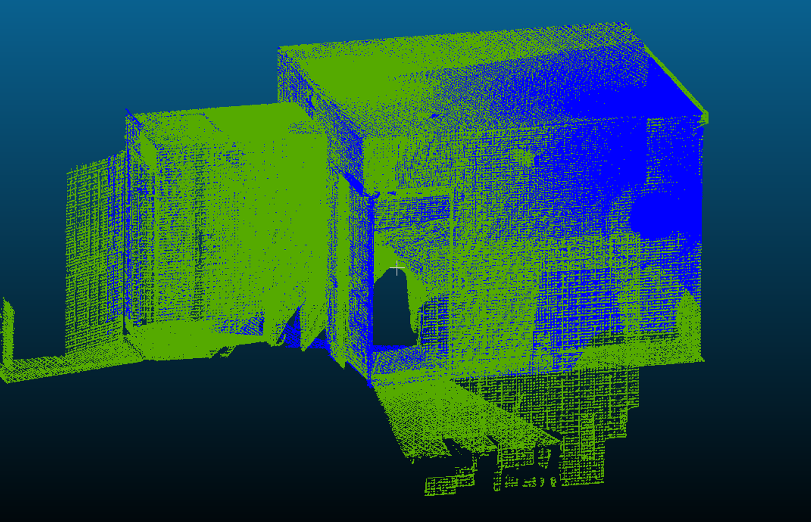
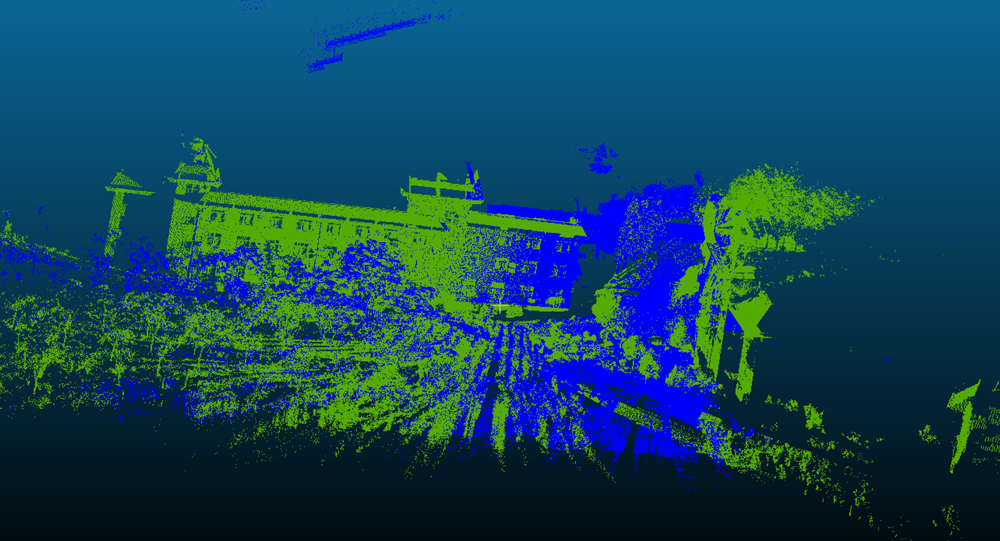

# Line Group-Based Point Cloud Registration via Weighted Hough Transform and Bipartite Graph Matching Approach

Point cloud registration (PCR) is a fundamental task in various applications, including 3D scene reconstruction, cultural heritage preservation, and deformation monitoring. This code implements a parallel line group-based PCR algorithm using the weighted Hough transform and the maximal weight bipartite graph matching.

# Dataset
This code was tested on four datasets:

**Indoor Scenes** (Office, Apartment, Boardroom):
- Source: [Redwood Data - Indoor LiDAR-RGBD](http://redwood-data.org/indoor_lidar_rgbd/download.html)

**Outdoor Scene** (Park):
- Source: [WHU-TLS Benchmark](https://3s.whu.edu.cn/ybs/en/benchmark.htm)

# Visual Results
<table>
  <tr>
    <td></td>
    <td></td>
  </tr>
  <tr>
    <td align="center">Indoor Scene (Apartment)</td>
    <td align="center">Outdoor Scene (Park)</td>
  </tr>
</table>

# Requirements
- MATLAB R2019b or later
- Computer Vision Toolbox
- Statistics and Machine Learning Toolbox
- Image Processing Toolbox
